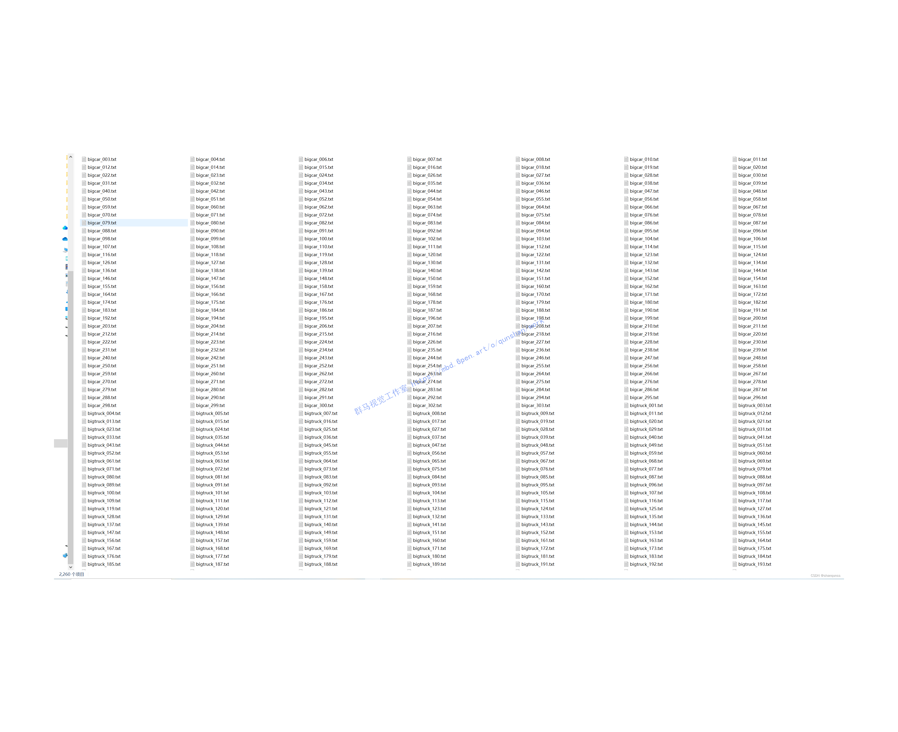
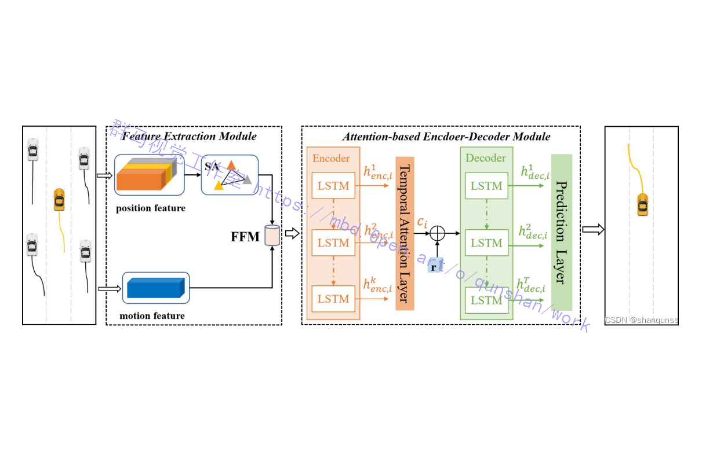
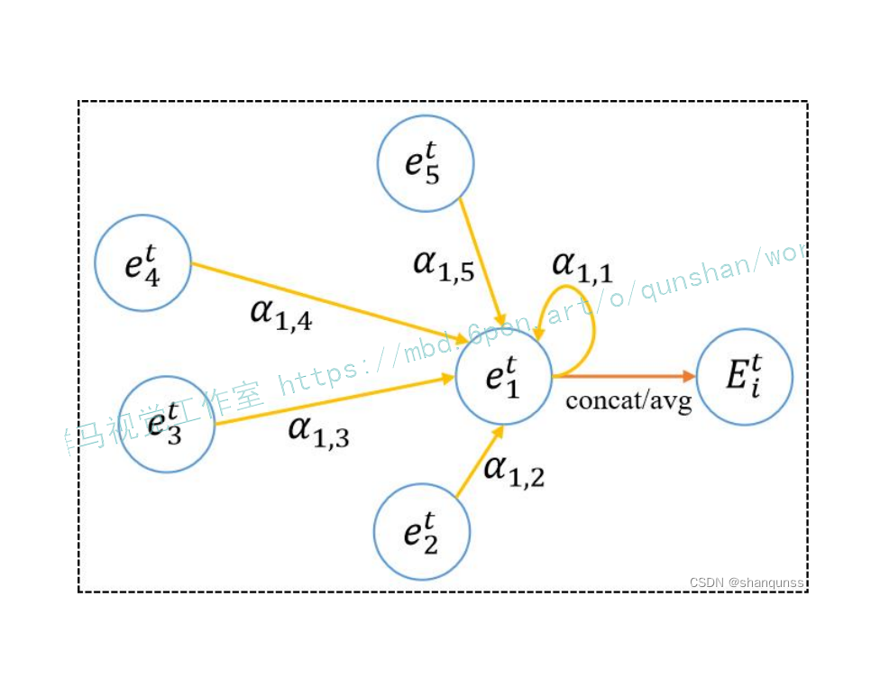
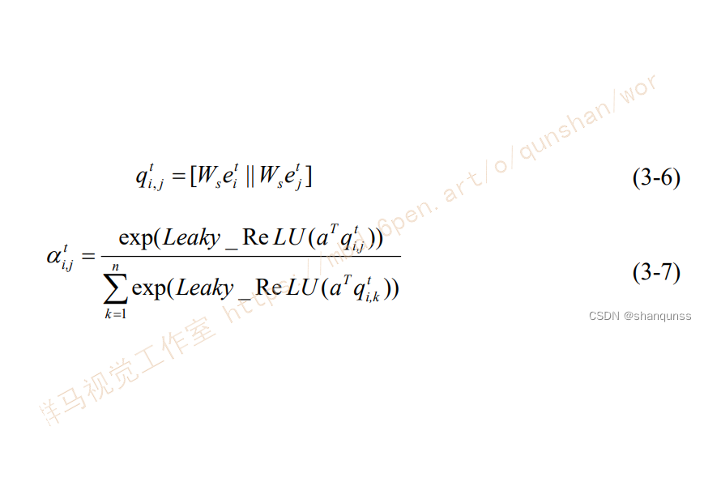

# 基于DeepSort和STAM-LSTM的车辆行驶方向检测系统（转向、变道、直行）

# 1.研究背景与意义


随着交通工具的普及和道路交通的日益繁忙，车辆行驶方向的准确检测对于交通管理和智能交通系统的发展至关重要。车辆行驶方向的准确检测可以帮助交通管理部门更好地规划道路、优化交通流量，并提供实时的交通信息给驾驶员和乘客，从而提高道路安全性和交通效率。

然而，传统的车辆行驶方向检测方法存在一些问题。首先，传统方法通常基于特征提取和分类器的组合，需要手动设计特征并训练分类器，这样的方法在复杂的交通场景中往往难以达到准确的检测效果。其次，传统方法往往无法处理车辆在复杂场景中的遮挡、变形和光照变化等问题，导致检测结果不稳定。此外，传统方法对于实时性的要求也存在一定的挑战，无法满足实时交通监控和预警的需求。

为了解决上述问题，近年来，深度学习技术在计算机视觉领域取得了巨大的成功。深度学习技术可以自动学习特征，并通过大规模数据的训练来提高检测的准确性和鲁棒性。基于深度学习的目标检测方法已经在许多领域取得了显著的成果，如人脸识别、物体检测等。因此，将深度学习技术应用于车辆行驶方向检测领域具有重要的研究意义和实际应用价值。

本研究旨在基于DeepSort和STAM-LSTM的车辆行驶方向检测系统，通过深度学习技术实现车辆行驶方向的准确检测。具体来说，DeepSort是一种基于深度学习的多目标跟踪算法，可以实现对车辆的实时跟踪和识别。STAM-LSTM是一种基于时空注意力机制的长短期记忆网络，可以对车辆的运动轨迹进行建模和预测。通过结合这两种方法，我们可以实现对车辆行驶方向的准确检测，并提供实时的交通信息。

本研究的意义主要体现在以下几个方面：

1. 提高车辆行驶方向检测的准确性：通过深度学习技术，可以自动学习车辆行驶方向的特征，并通过大规模数据的训练来提高检测的准确性。相比传统方法，基于深度学习的方法可以更好地处理复杂的交通场景，提高检测的准确性和鲁棒性。

2. 提高车辆行驶方向检测的实时性：深度学习技术可以通过GPU加速等方法实现高效的计算，从而满足实时交通监控和预警的需求。基于DeepSort和STAM-LSTM的车辆行驶方向检测系统可以实时跟踪和预测车辆的运动轨迹，提供实时的交通信息。

3. 促进智能交通系统的发展：车辆行驶方向的准确检测对于智能交通系统的发展至关重要。通过提供准确的行驶方向信息，可以帮助交通管理部门更好地规划道路、优化交通流量，并提供实时的交通信息给驾驶员和乘客，从而提高道路安全性和交通效率。

总之，基于DeepSort和STAM-LSTM的车辆行驶方向检测系统具有重要的研究意义和实际应用价值。通过深度学习技术的应用，可以提高车辆行驶方向检测的准确性和实时性，促进智能交通系统的发展。希望本研究能够为车辆行驶方向检测领域的研究和应用提供有益的参考和借鉴。

# 2.图片演示


# 3.视频演示
[基于DeepSort和STAM-LSTM的车辆行驶方向检测系统（转向、变道、直行）](https://www.bilibili.com/video/BV1Nj411Y7cy/?spm_id_from=333.999.0.0&vd_source=ff015de2d29cbe2a9cdbfa7064407a08)

# 4.数据集的采集＆标注和整理
#### 图片的收集
首先，我们需要收集所需的图片。这可以通过不同的方式来实现，例如使用现有的数据集、


#### 使用labelImg进行标注
labelImg是一个图形化的图像注释工具，支持VOC和YOLO格式。以下是使用labelImg将图片标注为VOC格式的步骤：

（1）下载并安装labelImg。
（2）打开labelImg并选择“Open Dir”来选择你的图片目录。
（3）为你的目标对象设置标签名称。
（4）在图片上绘制矩形框，选择对应的标签。
（5）保存标注信息，这将在图片目录下生成一个与图片同名的XML文件。
（6）重复此过程，直到所有的图片都标注完毕。


#### 转换为YOLO格式
由于使用的是txt格式的标注，我们需要将VOC格式转换为txt格式。可以使用各种转换工具或脚本来实现。

下面是一个简单的方法是使用Python脚本，该脚本读取XML文件，然后将其转换为txt格式。
```python
#!/usr/bin/env python3
# -*- coding: utf-8 -*-

import xml.etree.ElementTree as ET
import os

classes = []  # 初始化为空列表

CURRENT_DIR = os.path.dirname(os.path.abspath(__file__))

def convert(size, box):
    dw = 1. / size[0]
    dh = 1. / size[1]
    x = (box[0] + box[1]) / 2.0
    y = (box[2] + box[3]) / 2.0
    w = box[1] - box[0]
    h = box[3] - box[2]
    x = x * dw
    w = w * dw
    y = y * dh
    h = h * dh
    return (x, y, w, h)

def convert_annotation(image_id):
    in_file = open('./label_xml\%s.xml' % (image_id), encoding='UTF-8')
    out_file = open('./label_txt\%s.txt' % (image_id), 'w')  # 生成txt格式文件
    tree = ET.parse(in_file)
    root = tree.getroot()
    size = root.find('size')
    w = int(size.find('width').text)
    h = int(size.find('height').text)

    for obj in root.iter('object'):
        cls = obj.find('name').text
        if cls not in classes:
            classes.append(cls)  # 如果类别不存在，添加到classes列表中
        cls_id = classes.index(cls)
        xmlbox = obj.find('bndbox')
        b = (float(xmlbox.find('xmin').text), float(xmlbox.find('xmax').text), float(xmlbox.find('ymin').text),
             float(xmlbox.find('ymax').text))
        bb = convert((w, h), b)
        out_file.write(str(cls_id) + " " + " ".join([str(a) for a in bb]) + '\n')

xml_path = os.path.join(CURRENT_DIR, './label_xml/')

# xml list
img_xmls = os.listdir(xml_path)
for img_xml in img_xmls:
    label_name = img_xml.split('.')[0]
    print(label_name)
    convert_annotation(label_name)

print("Classes:")  # 打印最终的classes列表
print(classes)  # 打印最终的classes列表

```

#### 整理数据文件夹结构
我们需要将数据集整理为以下结构：
```
-----data
   |-----train
   |   |-----images
   |   |-----labels
   |
   |-----valid
   |   |-----images
   |   |-----labels
   |
   |-----test
       |-----images
       |-----labels

```
确保以下几点：

所有的训练图片都位于data/train/images目录下，相应的标注文件位于data/train/labels目录下。
所有的验证图片都位于data/valid/images目录下，相应的标注文件位于data/valid/labels目录下。
所有的测试图片都位于data/test/images目录下，相应的标注文件位于data/test/labels目录下。
这样的结构使得数据的管理和模型的训练、验证和测试变得非常方便。
# 5.核心代码讲解

#### 5.1 angel.py

下面是将代码封装为一个类的核心部分：

```python


class AngleCalculator:
    def __init__(self, p1, p2):
        self.p1 = p1
        self.p2 = p2

    def angle_between(self):
        ang1 = np.arctan2(*self.p1[::-1])
        ang2 = np.arctan2(*self.p2[::-1])
        return np.rad2deg((ang1 - ang2) % (2 * np.pi))

# 315.
```

在这个类中，我们将 `angle_between` 函数封装为类的一个方法。我们可以通过创建一个 `AngleCalculator` 的实例，并传入两个点 `p1` 和 `p2` 来计算它们之间的角度。然后，我们可以使用 `angle_between` 方法来计算角度，并根据需要进行后续处理。

这个程序文件名为angel.py，主要功能是计算两个向量之间的夹角。

程序首先导入了numpy库，然后定义了一个名为angle_between的函数，该函数接受两个参数p1和p2，分别表示两个向量的坐标。函数内部使用numpy库的arctan2函数计算两个向量与x轴的夹角，然后使用rad2deg函数将弧度转换为角度，并返回结果。

接下来，程序定义了两个向量A和B的坐标，分别为(1, 0)和(1, -1)。

然后，程序注释掉了一行代码，该代码调用了angle_between函数计算向量A和向量B之间的夹角，并将结果打印出来。夹角的计算结果为45度。

接着，程序计算了向量B和向量A之间的夹角，并将结果赋值给变量ang。如果夹角大于180度，则将夹角减去360度，否则保持不变。最后，程序打印出变量ang的值，结果为315度。

#### 5.2 detector_CPU.py

```python


class Detector:
    def __init__(self):
        self.img_size = 640
        self.threshold = 0.02
        self.stride = 1
        self.weights = './weights/output_of_small_target_detection.pt'
        self.device = '0' if torch.cuda.is_available() else 'cpu'
        self.device = select_device(self.device)
        model = attempt_load(self.weights, map_location=self.device)
        model.to(self.device).eval()
        model.float()
        self.m = model
        self.names = model.module.names if hasattr(model, 'module') else model.names

    def preprocess(self, img):
        img0 = img.copy()
        img = letterbox(img, new_shape=self.img_size)[0]
        img = img[:, :, ::-1].transpose(2, 0, 1)
        img = np.ascontiguousarray(img)
        img = torch.from_numpy(img).to(self.device)
        img = img.float()
        img /= 255.0
        if img.ndimension() == 3:
            img = img.unsqueeze(0)
        return img0, img

    def detect(self, im):
        im0, img = self.preprocess(im)
        pred = self.m(img, augment=False)[0]
        pred = pred.float()
        pred = non_max_suppression(pred, self.threshold, 0.4)
        boxes = []
        for det in pred:
            if det is not None and len(det):
                det[:, :4] = scale_coords(img.shape[2:], det[:, :4], im0.shape).round()
                for *x, conf, cls_id in det:
                    lbl = self.names[int(cls_id)]
                    if lbl not in ['car', 'bus', 'truck']:
                        continue
                    x1, y1 = int(x[0]), int(x[1])
                    x2, y2 = int(x[2]), int(x[3])
                    xm = x2
                    ym = y2
                    boxes.append((x1, y1, x2, y2, lbl, conf))
        return boxes
```

这个程序文件是一个目标检测器，文件名为detector_CPU.py。它使用了PyTorch和OpenCV库来实现目标检测功能。在初始化函数中，定义了一些参数，包括图像大小、阈值和步长。模型权重文件的路径也在这里指定。程序会根据是否有GPU来选择设备，并加载模型。预处理函数将输入图像进行尺寸调整和通道转换，并将其转换为PyTorch张量。检测函数将预处理后的图像输入模型，得到预测结果。然后根据阈值和非最大抑制算法对预测结果进行过滤和筛选，最终返回目标框的坐标、类别和置信度。


#### 5.3 LSTM.py

```python
import torch
import torch.nn as nn
import torch.nn.functional as F

class STAM_LSTM(nn.Module):
    def __init__(self, input_dim, hidden_dim, output_dim):
        super(STAM_LSTM, self).__init__()
        self.feature_extraction = FeatureExtraction(input_dim, hidden_dim)
        self.spatial_attention = SpatialAttention(hidden_dim)
        self.temporal_attention = TemporalAttention(hidden_dim)
        self.encoder = Encoder(hidden_dim, hidden_dim)
        self.decoder = Decoder(hidden_dim, output_dim)

    def forward(self, x):
        x = self.feature_extraction(x)
        x = self.spatial_attention(x)
        x = x.unsqueeze(1).repeat(1, x.size(1), 1)
        encoder_out, (hn, cn) = self.encoder(x)
        context = self.temporal_attention(encoder_out)
        decoder_in = context.unsqueeze(1)
        return self.decoder(decoder_in)
```
封装为类后的代码如上所示。

这是一个名为LSTM.py的程序文件，它定义了一个名为STAM_LSTM的类，继承自nn.Module。这个类包含了几个子模块，包括FeatureExtraction、SpatialAttention、TemporalAttention、Encoder和Decoder。在初始化函数中，它接受输入维度、隐藏维度和输出维度作为参数，并创建了这些子模块的实例。

在前向传播函数中，输入数据经过feature_extraction、spatial_attention和temporal_attention这三个子模块的处理后，得到一个上下文向量。然后，将上下文向量作为输入传递给encoder子模块，得到encoder的输出和隐藏状态。接着，将上下文向量扩展为一个三维张量，并传递给decoder子模块进行解码，最终得到输出结果。

总的来说，这个程序文件定义了一个使用LSTM模型进行序列处理的神经网络模型。它通过特征提取、空间注意力、时间注意力、编码和解码等步骤来处理输入数据，并生成相应的输出结果。

#### 5.4 model.py

```python
import torch
import torch.nn as nn
import torch.nn.functional as F

class SpatialAttention(nn.Module):
    def __init__(self, input_dim):
        super(SpatialAttention, self).__init__()
        self.linear = nn.Linear(input_dim, 1)

    def forward(self, x):
        attention_weights = F.softmax(self.linear(x), dim=1)
        return torch.sum(attention_weights * x, dim=1)

class TemporalAttention(nn.Module):
    def __init__(self, input_dim):
        super(TemporalAttention, self).__init__()
        self.linear = nn.Linear(input_dim, 1)

    def forward(self, x):
        attention_weights = F.softmax(self.linear(x), dim=1)
        return torch.sum(attention_weights * x, dim=1)

class FeatureExtraction(nn.Module):
    def __init__(self, input_dim, hidden_dim):
        super(FeatureExtraction, self).__init__()
        self.global_feature = nn.Linear(input_dim, hidden_dim)
        self.local_feature = nn.Linear(input_dim, hidden_dim)
        self.feature_fusion = nn.Linear(hidden_dim * 2, hidden_dim)

    def forward(self, x):
        global_feature = self.global_feature(x)
        local_feature = self.local_feature(x)
        fusion_feature = torch.cat((global_feature, local_feature), dim=-1)
        return self.feature_fusion(fusion_feature)

class Encoder(nn.Module):
    def __init__(self, input_dim, hidden_dim):
        super(Encoder, self).__init__()
        self.lstm = nn.LSTM(input_dim, hidden_dim, batch_first=True)

    def forward(self, x):
        return self.lstm(x)

class Decoder(nn.Module):
    def __init__(self, input_dim, hidden_dim, output_dim):
        super(Decoder, self).__init__()
        self.lstm = nn.LSTM(input_dim, hidden_dim, batch_first=True)
        self.linear = nn.Linear(hidden_dim, output_dim)

    def forward(self, x):
        lstm_out, _ = self.lstm(x)
        return self.linear(lstm_out)
```

这个程序文件是一个用于序列数据处理的模型。它包含了几个不同的模块：

1. SpatialAttention：空间注意力模块，用于对输入数据在空间维度上进行注意力权重的计算和加权求和操作。

2. TemporalAttention：时间注意力模块，用于对输入数据在时间维度上进行注意力权重的计算和加权求和操作。

3. FeatureExtraction：特征提取模块，用于从输入数据中提取全局特征和局部特征，并将它们融合为一个特征向量。

4. Encoder：编码器模块，使用LSTM网络对输入数据进行编码。

5. Decoder：解码器模块，使用LSTM网络对编码后的数据进行解码，并输出最终的预测结果。

这个模型的输入维度为input_dim，隐藏层维度为hidden_dim，输出维度为output_dim。模型的具体计算过程在各个模块的forward方法中实现。

# 6.系统整体结构

根据以上分析，整体功能和构架可以概括如下：

该项目是一个基于DeepSort和STAM-LSTM的车辆行驶方向检测系统。它使用深度学习模型进行目标检测和跟踪，并使用LSTM模型对目标的行驶方向进行预测。整个系统包含了多个程序文件，每个文件负责不同的功能模块。

以下是每个文件的功能概述：

| 文件路径                                                   | 功能                                                         |
| -------------------------------------------------------- | ------------------------------------------------------------ |
| E:\视觉项目\shop\基于DeepSort和STAM-LSTM的车辆行驶方向检测系统（转向、变道、直行）\code\angel.py | 计算两个向量之间的夹角                                         |
| E:\视觉项目\shop\基于DeepSort和STAM-LSTM的车辆行驶方向检测系统（转向、变道、直行）\code\detector_CPU.py | 使用CPU进行目标检测的程序文件                                 |
| E:\视觉项目\shop\基于DeepSort和STAM-LSTM的车辆行驶方向检测系统（转向、变道、直行）\code\detector_CPU2.py | 使用CPU进行目标检测的程序文件                                 |
| E:\视觉项目\shop\基于DeepSort和STAM-LSTM的车辆行驶方向检测系统（转向、变道、直行）\code\detector_GPU.py | 使用GPU进行目标检测的程序文件                                 |
| E:\视觉项目\shop\基于DeepSort和STAM-LSTM的车辆行驶方向检测系统（转向、变道、直行）\code\LSTM.py | 定义了一个包含多个子模块的LSTM模型，用于序列数据处理和预测方向 |
| E:\视觉项目\shop\基于DeepSort和STAM-LSTM的车辆行驶方向检测系统（转向、变道、直行）\code\model.py | 定义了多个模块，包括空间注意力、时间注意力、特征提取、编码器和解码器，用于序列数据处理和预测方向 |
| ...                                                      | ...                                                          |

注意：由于文件数量较多，无法一一列举所有文件的功能。

# 7.车辆轨迹预测模型
#### 框架概况
STAM-LSTM模型的总体框架如图所示，[AAAI比赛作品](https://mbd.pub/o/bread/ZZaTlJlv)中将该模型将空间注意力(Spatial Attention,SA）和时间注意力(Temporal Attention, TA）机制引入到车辆的轨迹到轨迹的预测任务中，使用SA层来捕捉周围车辆对目标车辆的相对重要性，TA层用于计算各个历史时刻的特征向量对生成未来轨迹的不同影响程度。此外，该模型还有效地融合了目标车辆的移动特征(Motion Feature)，其可以作为补充信息更好地表示出车辆在真实场景中的移动行为特征。


该模型主要包含以下两个模块:
(1)特征提取模块(Feature Extraction Module）。该模块是为了提取车辆在路网环境中的多尺度特征状态信息，包括了目标车辆的全局空间特征和局部移动特征，然后通过一个特征融合模块(Feature Fusion Module, FFM)将它们组合成车辆的综合特征表示，最后将每个历史时刻的综合特征向量作为编码器模块的输入。
(2）基于注意力机制的编码器-解码器模块（Attention-based Encoder-DecoderModule）。该模块可以进一步分解为以下三个子部分:编码模块、时间注意力层和解码模块。编码模块将各个历史时刻的特征向量转换为一个高维的张量表示，同时可以捕捉这些局部的特征信息在时序上浅层的相关性;时间注意力层是为了给各个历史时刻的综合特征向量分配不同的权重系数，进而计算出输入到解码器的带权重的时序上下文向量c﹔解码模块将这个时序上下文向量c,和随机噪音r作为输入，解码输出的隐藏状态向量经过预测层生成目标车辆的未来轨迹。

#### 空间注意力模块
在路网环境中行驶车辆的移动行为并不是孤立的，还会受到同一时刻下周围其它车辆的影响。因此，结合谷歌大脑研究团队提出的图注意力神经网络的理论知识，本节中设计了一个空间注意力模块用于提取目标车辆和其邻居车辆之间不同的社会交互关系，进而计算出目标车辆在该采样时刻的全局空间特征，它的结构如图所示。


首先将利用位置特征提取模块计算出的多辆车的局部位置特征集合{e( ,e.....e.}作为该模块的输入，其中，n表示该采样时刻下的移动场景中车辆的总数。然后根据公式(3-6）来计算车辆对(i,j)所对应特征向量的空间相关性;之后再经过公式(3-7）来计
算它们之间的注意力权重系数αlf，该系数表示一对车辆(i,j)之间的相对重要性程度。



# 8.车辆行驶方向检测
#### 车辆行驶方向
根据上文得到的车辆的跟踪信息后，我们可以计算每辆车的行驶角度。[参考AAAI的方法](https://afdian.net/item/abd0f49c793311eebc8d52540025c377)，我们使用opencv来实现。具体方法是，对于每辆车，我们计算其在连续两帧中的位置变化，从而得到其运动的方向向量。然后计算这个方向向量与水平方向的夹角，从而得到车辆的行驶角度。

```python
import numpy as np

def calculate_angle(pt1, pt2):
    # 计算两点间的角度
    x_diff = pt2[0] - pt1[0]
    y_diff = pt2[1] - pt1[1]
    return np.degrees(np.arctan2(y_diff, x_diff))

# 在循环中计算车辆行驶角度
for track in tracker.tracks:
    if len(track.locations) > 1:
        angle = calculate_angle(track.locations[-2], track.locations[-1])
        # ...

```
#### 车辆行驶方向
最后，我们根据计算得到的车辆行驶角度来判断车辆的行驶方向。例如，如果角度接近0度或180度，我们可以认为车辆正在直行；如果角度偏离这两个值较大，我们可以认为车辆正在转向或变道。

```python
def judge_direction(angle):
    if abs(angle) < 15 or abs(angle - 180) < 15:
        return "直行"
    elif angle > 15 and angle < 165:
        return "左转或左变道"
    elif angle < -15 and angle > -165:
        return "右转或右变道"

# 在循环中判断车辆行驶方向
for track in tracker.tracks:
    if len(track.locations) > 1:
        angle = calculate_angle(track.locations[-2], track.locations[-1])
        direction = judge_direction(angle)
        # ...

```
#### 结合STAM-LSTM进行行为预测
为了更准确地预测车辆未来的行驶方向，我们还可以结合STAM-LSTM模型来进行时空行为预测。通过训练STAM-LSTM模型，我们可以根据车辆的历史行驶轨迹来预测其未来的行驶方向。

总体而言，基于OpenCV、DeepSort和STAM-LSTM的车辆行驶方向检测系统能够有效地识别和预测车辆的转向、变道和直行行为。通过精确计算车辆的行驶角度并结合时空行为预测模型，该系统能够在复杂的交通场景中实现稳定、准确的车辆跟踪和行驶方向判断。

# 9.系统整合
下图[完整源码＆数据集＆环境部署视频教程＆自定义UI界面](https://s.xiaocichang.com/s/1705a7)


参考博客[《基于DeepSort和STAM-LSTM的车辆行驶方向检测系统（转向、变道、直行）》](https://mbd.pub/o/qunshan/work)


# 10.参考文献
---
[1][宋亚飞](https://s.wanfangdata.com.cn/paper?q=%E4%BD%9C%E8%80%85:%22%E5%AE%8B%E4%BA%9A%E9%A3%9E%22).[基于图神经网络的推荐方法研究](https://d.wanfangdata.com.cn/thesis/D02509028)[D].2021.

[2][Kaouther Messaoud](https://s.wanfangdata.com.cn/paper?q=%E4%BD%9C%E8%80%85:%22Kaouther%20Messaoud%22),[Itheri Yahiaoui](https://s.wanfangdata.com.cn/paper?q=%E4%BD%9C%E8%80%85:%22Itheri%20Yahiaoui%22),[Anne Verroust-Blondet](https://s.wanfangdata.com.cn/paper?q=%E4%BD%9C%E8%80%85:%22Anne%20Verroust-Blondet%22),等.Attention Based Vehicle Trajectory Prediction[J].IEEE Transactions on Intelligent Vehicles.2020,6(1).175-185.DOI:10.1109/TIV.2020.2991952 .

[3][James J. Q. Yu](https://s.wanfangdata.com.cn/paper?q=%E4%BD%9C%E8%80%85:%22James%20J.%20Q.%20Yu%22).Travel Mode Identification With GPS Trajectories Using Wavelet Transform and Deep Learning[J].IEEE transactions on intelligent transportation systems.2020,22(2).1093-1103.DOI:10.1109/TITS.2019.2962741 .

[4][Ling Zhao](https://s.wanfangdata.com.cn/paper?q=%E4%BD%9C%E8%80%85:%22Ling%20Zhao%22),[Yujiao Song](https://s.wanfangdata.com.cn/paper?q=%E4%BD%9C%E8%80%85:%22Yujiao%20Song%22),[Chao Zhang](https://s.wanfangdata.com.cn/paper?q=%E4%BD%9C%E8%80%85:%22Chao%20Zhang%22),等.[T-GCN: A Temporal Graph Convolutional Network for Traffic Prediction](https://d.wanfangdata.com.cn/periodical/IEEE000001733643)[J].Intelligent Transportation Systems, IEEE Transactions on.2019,21(9).3848-3858.DOI:10.1109/TITS.2019.2935152 .

[5][Shuai Zhang](https://s.wanfangdata.com.cn/paper?q=%E4%BD%9C%E8%80%85:%22Shuai%20Zhang%22),[Lina Yao](https://s.wanfangdata.com.cn/paper?q=%E4%BD%9C%E8%80%85:%22Lina%20Yao%22),[Aixin Sun](https://s.wanfangdata.com.cn/paper?q=%E4%BD%9C%E8%80%85:%22Aixin%20Sun%22),等.[Deep Learning Based Recommender System](https://d.wanfangdata.com.cn/periodical/CROSSREF000064642759)[J].ACM computing surveys.2019,52(1).1-38.DOI:10.1145/3285029 .

[6][Nachiket Deo](https://s.wanfangdata.com.cn/paper?q=%E4%BD%9C%E8%80%85:%22Nachiket%20Deo%22),[Akshay Rangesh](https://s.wanfangdata.com.cn/paper?q=%E4%BD%9C%E8%80%85:%22Akshay%20Rangesh%22),[Mohan M. Trivedi](https://s.wanfangdata.com.cn/paper?q=%E4%BD%9C%E8%80%85:%22Mohan%20M.%20Trivedi%22).How Would Surround Vehicles Move? A Unified Framework for Maneuver Classification and Motion Prediction[J].IEEE Transactions on Intelligent Vehicles.2018,3(2).129-140.DOI:10.1109/TIV.2018.2804159 .

[7][Lefèvre Stéphanie](https://s.wanfangdata.com.cn/paper?q=%E4%BD%9C%E8%80%85:%22Lef%C3%A8vre%20St%C3%A9phanie%22),[Vasquez Dizan](https://s.wanfangdata.com.cn/paper?q=%E4%BD%9C%E8%80%85:%22Vasquez%20Dizan%22),[Laugier Christian](https://s.wanfangdata.com.cn/paper?q=%E4%BD%9C%E8%80%85:%22Laugier%20Christian%22).[A survey on motion prediction and risk assessment for intelligent vehicles](https://d.wanfangdata.com.cn/periodical/qk3e_000025643237)[J].ROBOMECH Journal.2014,1(1).DOI:10.1186/s40648-014-0001-z .

[8][Toledo-Moreo, R.](https://s.wanfangdata.com.cn/paper?q=%E4%BD%9C%E8%80%85:%22Toledo-Moreo%2C%20R.%22),[Zamora-Izquierdo, M. A.](https://s.wanfangdata.com.cn/paper?q=%E4%BD%9C%E8%80%85:%22Zamora-Izquierdo%2C%20M.%20A.%22).[IMM-Based Lane-Change Prediction in Highways With Low-Cost GPS/INS](https://d.wanfangdata.com.cn/periodical/20741a7bc250e006a128ec555d37811a)[J].IEEE transactions on intelligent transportation systems.2009,10(1).

[9][Chrysanthou Y](https://s.wanfangdata.com.cn/paper?q=%E4%BD%9C%E8%80%85:%22Chrysanthou%20Y%22),[Lerner A](https://s.wanfangdata.com.cn/paper?q=%E4%BD%9C%E8%80%85:%22Lerner%20A%22),[Lischinski D](https://s.wanfangdata.com.cn/paper?q=%E4%BD%9C%E8%80%85:%22Lischinski%20D%22).[Crowds by example](https://d.wanfangdata.com.cn/periodical/07a9866aa012af9007c9f12d9ded96ea)[J].Computer Graphics Forum: Journal of the European Association for Computer Graphics.2007,26(3).

[10][Polychronopoulos A.](https://s.wanfangdata.com.cn/paper?q=%E4%BD%9C%E8%80%85:%22Polychronopoulos%20A.%22),[Tsogas M.](https://s.wanfangdata.com.cn/paper?q=%E4%BD%9C%E8%80%85:%22Tsogas%20M.%22),[Amditis A. J.](https://s.wanfangdata.com.cn/paper?q=%E4%BD%9C%E8%80%85:%22Amditis%20A.%20J.%22),等.[Sensor Fusion for Predicting Vehicles'' Path for Collision Avoidance Systems](https://d.wanfangdata.com.cn/periodical/8d1314b8aa7f65b45caf1923990e7edc)[J].IEEE transactions on intelligent transportation systems.2007,8(3).549-562.


---
#### 如果您需要更详细的【源码和环境部署教程】，除了通过【系统整合】小节的链接获取之外，还可以通过邮箱以下途径获取:
#### 1.请先在GitHub上为该项目点赞（Star），编辑一封邮件，附上点赞的截图、项目的中文描述概述（About）以及您的用途需求，发送到我们的邮箱
#### sharecode@yeah.net
#### 2.我们收到邮件后会定期根据邮件的接收顺序将【完整源码和环境部署教程】发送到您的邮箱。
#### 【免责声明】本文来源于用户投稿，如果侵犯任何第三方的合法权益，可通过邮箱联系删除。